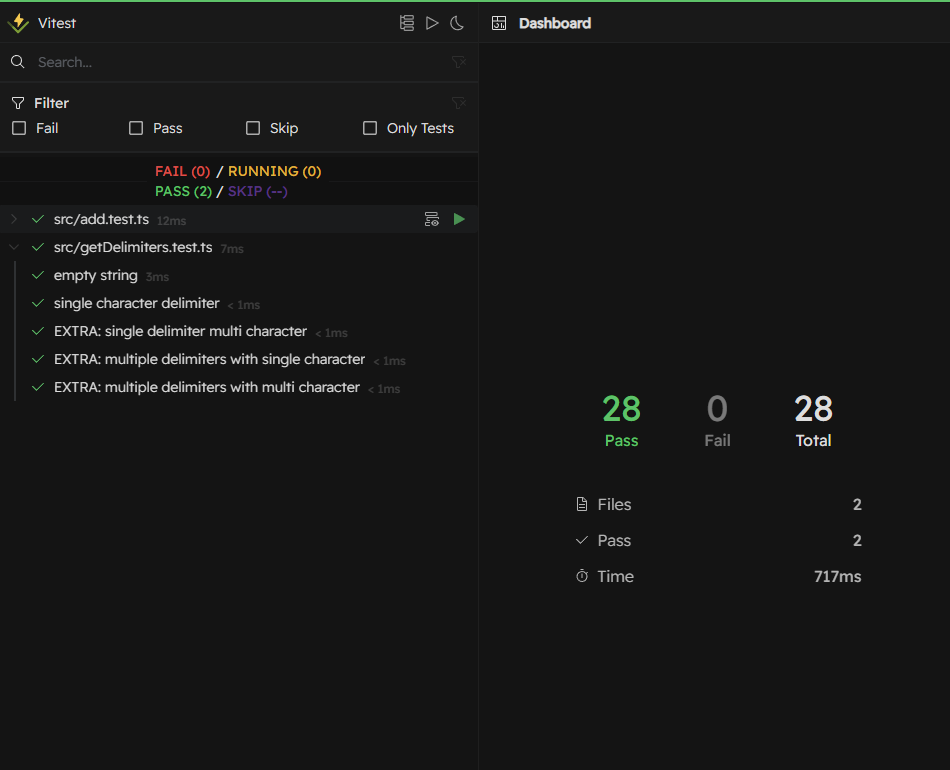

# String Calculator

String Calculator with TypeScript, NodeJS, Vitest

---

## TEST UI - SCREENSHOT: 

---

## Dev Setup
- Clone the repo
- Install pnpm using `npm i -g pnpm`
- Run `pnpm install` to install the required dependencies
- Run `pnpm test` to run the tests
- Run `pnpm test:ui` to run the tests with interactive UI view in browser

## Tech Stack
- TypeScript
- Vite
- Vitest
- Vitest UI

## Extra Cases Handled
- Ignore digits with value greater than 1000
- single character multiple delimiters
- multi character single delimiter
- multi character multiple delimiters 

## Further Enhancements

- Handle as * and combination of * as custom delimiter